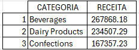

# 💡 Desafio SQL: Análise de Faturamento Northwind (Projeto Lighthouse)


Projeto desenvolvido durante o Ciclo Básico da formação Lighthouse (Indicium), sob orientação da professora **Bea Kenup**, focado em extrair insights estratégicos de um banco de dados relacional.

## Objetivo
Identificar as **3 categorias de produtos que mais geraram receita total** para a empresa, fornecendo uma visão clara do desempenho de vendas por segmento.

## Base de Dados
Utilizei o banco de dados **Northwind** , um dataset clássico que simula as operações de uma empresa, fornecido pela Indicium Academy.

## Estratégia
Para responder à pergunta de negócio, a análise seguiu este fluxo lógico:
1. Relacionar a tabela de categorias com os itens vendidos
2. Calcular o valor líquido de cada item, multiplicando o preço pela quantidade e aplicando o percentual de desconto.
3. Agrupar os valores por categoria.
4. Rankear os resultados em ordem decrescente para selecionar o Top 3.

## Conceitos Aplicados
🔸 **Join:** Conexão entre `Category`, `Product` e `OrderDetail`;

🔸**Funções de Agregação:** `SUM()` para consolidar a receita;

🔸**Operações Aritméticas:** Cálculo de receita líquida considerando descontos: `UnitPrice * Quantity * (1 - Discount)`;

🔸**Agrupamento e Ordenação:** `GROUP BY` e `ORDER BY` para estruturar o ranking;

🔸**Limitação de Dados:** `LIMIT` para extrair apenas os registros desejados.

## Query SQL
```sql
SELECT 
    Category.CategoryName AS CATEGORIA,
    ROUND(SUM(OrderDetail.UnitPrice * Quantity * (1 - Discount)), 2) AS RECEITA
FROM Category
JOIN Product
    ON Category.Id = Product.CategoryId
JOIN OrderDetail
    ON OrderDetail.ProductId = Product.Id
GROUP BY Category.CategoryName
ORDER BY RECEITA DESC
LIMIT 3;
```

## Resultado e Insight


Esta tabela mostra que a consulta identificou as três categorias que mais contribuíram para a receita total, permitindo que a gestão identifique onde está o maior volume financeiro da operação. Assim, poderemos tirar algumas conclusões:

🔸As categorias com maior receita podem ser priorizadas em ações comerciais, já que representam maior impacto financeiro para a empresa;

🔸A identificação das categorias mais rentáveis ajuda na definição de estratégias de estoque, evitando ruptura de produtos que têm maior peso na receita;

🔸Esse resultado pode servir como ponto de partida para análises mais profundas, como margem de lucro, sazonalidade ou desempenho por cliente/região.
